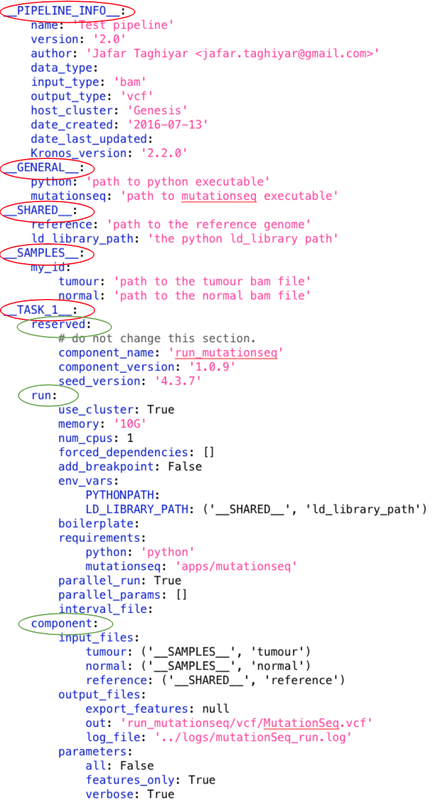

.. _config_file:

==================
Configuration file
==================
A configuration file generated by ``Kronos`` is a YAML_ file which describes a pipeline.
It contains all the parameters of all the :ref:`components <components>` in the pipeline as well as the information that builds the flow of the pipeline. 

.. _YAML: http://yaml.org/

A configuration file has the following major sections (shown in red ovals in the following figure):

- :ref:`__PIPELINE_INFO__ <pipeline_info_sec>`
- :ref:`__GENERAL__ <general_sec>`
- :ref:`__SHARED__ <shared_sec>`
- :ref:`__SAMPLES__ <samples_sec>`
- :ref:`__TASK_i__ <task_sec>`

where ``__TASK_i__`` has the following subsections (shown in green ovals in the following figure):

- :ref:`reserved <reserved_sec>`
- :ref:`run <run_sec>`
- :ref:`component <component_sec>`

..   caption goes here

.. _pipeline_info_sec:

Pipeline_info section
=====================
The ``__PIPELINE_INFO__`` section stores information about the pipeline itself and looks like the following:

.. code-block:: yaml

    __PIPELINE_INFO__:
        name: null
        version: null
        author: null
        data_type: null
        input_type: null
        output_type: null
        host_cluster: null
        date_created: null
        date_last_updated: null
        kronos_version: '2.0.0'

where: 

- ``name``: a name for the pipeline
- ``version``: version of the pipeline
- ``author``: name of the developer of the pipeline
- ``data_type``: this can be used for database purposes
- ``input_type``: type of the input files to the pipeline
- ``output_type``: type of the output files of the pipeline
- ``host_cluster``: a name a cluster used to run the pipeline or 'null' if the pipeline is designed to run only locally
- ``date_created``: date that the pipeline is created
- ``date_last_updated``: last date that the pipeline is updated
- ``kronos_version``: version of the ``kronos`` package that has generated the configuration file and is added automatically

.. topic:: Info

    All these fields are merely informative and do not have any impacts on the flow of the pipeline.

.. _general_sec:

General section
===============
``__GENERAL__`` section contains ``key:value`` pairs derived automatically from the ``requirements`` field of the :ref:`component_reqs` file of the components in the pipeline.
Each ``key`` corresponds to a particular requirement, e.g. Python, java, etc., and each ``value`` is the path to where the ``key`` is.
For instance, if there is ``python: /usr/bin/python`` entry in the requirements of a component in the pipeline, then you would have the following in the ``__GENERAL__`` section:

.. code-block:: yaml

    __GENERAL__: 
        python: '/usr/bin/python'

Now, let assume there is another Python installations on your machine in ``/path/my_python/bin/python`` and you prefer to use this instead.
You can simply change the path to the desired one:

.. code-block:: yaml

    __GENERAL__: 
        python: '/path/my_python/bin/python'

.. warning:: 

    This will overwrite the path of ``python`` installation specified in the requirements of *ALL* the components , hence the name ``GENERAL``. If you want to change the path for only one specific task, then you should use the :ref:`requirements<task_requirements>` entry in the :ref:`run <run_sec>` subsection of that task. Note that the task's requirements entry takes precedence over the ``__GENERAL__`` section.
    
.. _shared_sec:

Shared section
==============
In ``__SHARED__`` section you can define arbitrary ``key:value`` pairs and then use the keys as variables in the :ref:`task <task_sec>` sections.
This helps you to parameterize the task sections.
The mechanism that enables you to use variables is called :ref:`connection <connections>`. 

.. _connections:

Connections
^^^^^^^^^^^
A connection is simply a tuple, i.e. ``(x1, x2)``, where its first entry is always a section name, e.g. ``__SHARED__``, and the second entry is a key in that section, e.g. ``('__SHARED__', 'key1')`` which means: 'use the value assigned to the ``key1`` in the ``__SHARED__`` section'.
For example, in the following configuration file, the value of the parameter ``reference`` of ``__TASK_1__`` will be ``'GRCh37-lite.fa'`` at runtime:

.. code-block:: yaml

    __SHARED__:
        ref: 'GRCh37-lite.fa'

    __TASK_1__:
        component: 
            input_files: 
                reference: ('__SHARED__', 'ref')

.. topic:: Tip

    A connection to the ``__SHARED__`` section, i.e. its first entry is ``__SHARED__``, is called a *shared connection*.

.. topic:: Tip

    It is recommended to use shared connections for the parameters in different tasks that expect the same value from users.

.. _io_connection:

IO connection
*************
An IO connection is a connection whose first entry is a task name and its second entry is a parameter of that task, e.g. ``('__TASK_n__', 'param1')`` where ``param1`` is a parameter in ``__TASK_n__``.
For instance, in the following configuration, ``('__TASK_1__', 'out_file')`` is an IO connection which points to the ``out_file`` parameter of ``__TASK_1__``.
This connection means: 'use the value assigned to the ``out_file`` parameter of ``__TASK_1__`` for the ``in_file`` parameter of ``__TASK_2__``.
The value of the parameter ``in_file`` of ``__TASK_2__`` will be ``'some_file'`` at runtime.

.. code-block:: yaml

    __TASK_1__
        component:
            out_file: 'some_file'
    
    __TASK_2__
        component:
            in_file: ('__TASK_1__', 'out_file')

.. _samples_sec:

Samples section
===============
``__SAMPLES__`` section contains ``key:value`` pairs with a unique *ID* for each set of the pairs.
It enables users to run the same pipeline for different sets of input arguments at once, i.e. users can perform parameter sweep. 
``kronos`` will run the pipeline for all the sets simultaneously, i.e. in parallel mode.

For example, for the following configuration file, ``kronos`` will make two intermediate pipelines and runs them in parallel.
In one of the intermediate pipelines the values of ``tumour`` and ``normal`` parameters of ``__TASK_1__`` are ``'DAX1.bam'`` and ``'DAXN1.bam'``, respectively, while in the other one they are ``'DAX2.bam'`` and ``'DAXN2.bam'``, respectively.

.. code-block:: yaml

    __SAMPLES__:
        ID1:
            tumour: 'DAX1.bam'
            normal: 'DAXN1.bam'
        ID2:
            tumour: 'DAX2.bam'
            normal: 'DAXN2.bam'

    __TASK_1__:
        component: 
            input_files: 
                tumour: ('__SAMPLES__', 'tumour')
                normal: ('__SAMPLES__', 'normal')

The ID of each set of input arguments, e.g. ``ID1`` or ``ID2``, is used by ``kronos`` to create intermediate pipelines.

.. warning::

    Each ID in the ``__SAMPLES__`` section must be unique, otherwise their corresponding results will be overwritten.

.. warning::

    ``kronos`` creates the following directories in the :ref:`working directory <working_dir>` to store the intermediate pipelines:

    - intermediate_config_files
    - intermediate_pipeline_scripts

    Users should NOT modify them.

.. topic:: Tip

    A connection to the ``__SAMPLES__`` section, i.e. its first entry is ``__SAMPLES__``, is called a *sample connection*.

The differences between ``__SAMPLES__`` and ``__SHARED__`` sections are:

- a unique ID is required in the ``__SAMPLES__`` section for each set
- a separate individual pipeline is generated for each set of ``key:value`` pairs, i.e. for each ID, in the ``__SAMPLES__`` section

.. topic:: Tip

    The number of simultaneous parallel pipelines can be set by the user when running the pipeline using the :ref:`input option <options>` ``-n``.

.. _task_sec:

Task section
============
Each task section in a configuration file corresponds to a :ref:`component <components>`.
The name of a task section follows the convention ``__TASK_i__`` where ``i`` is a number used to make the name unique, e.g. ``__TASK_1__`` or ``__TASK_27__``.
If a task is run in parallel then there will be sections with names ``__TASK_i_j__`` which refer to the children of task ``__TASK_i__``, e.g. ``__TASK_1_1__``, ``__TASK_1_2__``, etc.
Each task section has following subsections:

- :ref:`reserved <reserved_sec>`
- :ref:`run <run_sec>`
- :ref:`component <component_sec>`

.. _reserved_sec:

Reserved subsection
^^^^^^^^^^^^^^^^^^^
This subsection contains information about the component of the task:

.. code-block:: yaml

    reserved: 
        # do not change this section
        component_name: 'name_of_component'
        component_version: 'version_of_component'
        seed_version: 'version_of_seed'

.. warning::

    The information in this subsection should NOT be altered by users and are automatically specified by ``kronos``.

.. _run_sec:

Run subsection
^^^^^^^^^^^^^^
This subsection is used to instruct the ``kronos`` how to run the task. It looks like the following example:

.. code-block:: yaml

    run: 
        use_cluster: False
        memory: '5G'
        num_cpus: 1
        forced_dependencies: []
        add_breakpoint: False
        env_vars: 
        boilerplate:
        requirements:
        parallel_run: False
        parallel_params: []
        interval_file: 

.. _use_cluster:

``use_cluster``
***************
You can determine if each task in a pipeline should be run locally or on a cluster using the boolean flag ``use_cluster``.
Therefore, in a single pipeline some tasks might be run locally while the others are submitted to a cluster.

.. warning::

    If ``use_cluster: True``, then pipeline should be run on a grid computer cluster.
    Otherwise you'll see the error message ``failed to load ClusterJobManager`` and pipeline would eventually fail.

.. warning:: 

    If ``use_cluster: True``, make sure you pass the correct path for the drmaa library specified by ``-d`` option (see :ref:`options` for more information on input options).
    The default value for ``-d`` option is ``$SGE_ROOT/lib/lx24-amd64/libdrmaa.so`` where ``SGE_ROOT`` environment variable is automatically added to the path, so you only need to specify the rest of the path if it is different than the default value.

.. _memory:

``memory``
**********
If you submit a task to a cluster, i.e. ``use_cluster: True``, then ``memory`` specifies the maximum amount of memory requested by the task.

.. _num_cpus:

``num_cpus``
**********
If you submit a task to a cluster, i.e. ``use_cluster: True``, then ``num_cpus`` specifies the number of cores requested by the task.

.. _forced_dependencies:

``forced_dependencies``
***********************
You can force a task to wait for some other tasks to finish by simply passing the list of their names to the attribute ``forced_dependencies`` of the task.
For example, in the following config ``__TASK_1__`` is forced to wait for ``__TASK_n__`` and ``__TASK_m__`` to finish running first. 

.. code-block:: yaml

    __TASK_1__:
        run:
            forced_dependencies: [__TASK_n__, __TASK_m__]

.. topic:: Tip

    ``forced_dependencies`` always expects a list, e.g. [], [``__TASK_n__``], [``__TASK_n__``, ``__TASK_m__``]. 

.. topic:: Info

    A dependency ``B`` for task ``A`` means that task ``A`` must wait for task ``B`` to finish first, then task ``A`` starts to run.

.. topic:: Info

    If there is an IO connection between two tasks, then an implicit dependency is inferred by ``kronos``. 

.. _breakpoint:

``add_breakpoint``
******************
A *breakpoint* forces a pipeline to pause.
If ``add_breakpoint: True`` for a task, pipeline will stop running after that task is done.
Once the pipeline is :ref:`relaunched <relaunch>`, it will resume running from where it left off.
This mechanism has a number of applications:

- if a part of a pipeline needs user's supervision, for example to visually inspect some output data, then adding a breakpoint can pause the pipeline for the user to make sure everything is as desired and the relaunch from that points.
- you can run a part of a pipeline several times, for example to fine tune some of the input arguments.
  This can happen by adding breakpoint to the start and end tasks for that part of the pipeline and relaunch the pipeline every time.
- you can run different parts of a single pipeline on different machines or clusters provided that the pipeline can access the files generated by the previous runs.
  For instance, you can run a pipeline locally up to some point (a breakpoint) and then relaunch the pipeline on a different machine or cluster to finish the rest of the tasks. 

.. topic:: Tip

    If a task is parallelized and it has ``add_breakpoint: True``, then the pipeline waits for all the children of the task to finish running and then applies the breakpoint.

.. note::

    When a breakpoint happens, all the running tasks are aborted. 

.. _env_var:

``env_var``
***********
You can specify a list of the environment variables, required for a task to run successfully, directly in the configuration file.
It looks like the following:

.. code-block:: yaml

    __TASK_n__:
        run:
            env_vars: 
                var1: value1
                var2: value2 

.. topic:: Tip

    If an environment variable accepts a list of values, you can pass a list to that environment variable.
    For example:
    
    .. code-block:: yaml
     
        env_vars: 
            var1: [value1, value2, ...]

.. _boilerplate:

``boilerplate``
***************
Using this attribute you can insert a command or an script, or in general a *boilerplate*, directly into a task.
The boilerplate is run prior to running the task.
For example, assume you need to setup your python path using `load module <http://modules.sourceforge.net/>`_ command.
You can either pass the command as follows:

.. code-block:: yaml

    __TASK_n__:
        run:
            boilerplate: 'load module python/2.7.6'

or save it in a file e.g. called ``setup_file``:

.. code-block:: yaml

    load module python/2.7.6

and pass the path to the file, e.g. ``/path/to/setup_file``, to the ``boilerplate`` attribute:

.. code-block:: yaml

    __TASK_n__:
        run:
            boilerplate: /path/to/setup_file

.. _task_requirements:

``requirements``
***************
Similar to the ``__GENERAL__`` section, this entry contains a list of ``key:value`` pairs derived automatically from the ``requirements`` field of the :ref:`component_reqs` file of the component. The difference is that this list contains only the requirements for this task and applies only to this task and not the rest of the tasks in the pipeline. 

It looks like the following:

.. code-block:: yaml

    __TASK_n__:
        run:
            requirements: 
                req1: value1
                req2: value2

.. topic:: Tip

    This entry takes precedence over the ``__GENERAL__`` section. If you want to get the values for the requirements from the ``__GENERAL__`` section, then simply leave the value for each requirements in this entry blank or pass ``null``. 
    For example:
    
    .. code-block:: yaml
     
        requirements: 
            req1: 
            req2:

.. _parallel_run:

``parallel_run``
****************
It is a boolean flag that specifies whether or not to run a task in parallel.
If ``parallel_run: True``, the task is automatically expanded to a number of children tasks that are run in parallel simultaneously.

.. warning::

    A task needs to be parallelizable to run in parallel.

.. topic:: Tip

    If a task is not parallelizable, the attributes :ref:`parallel_run`, :ref:`parallel_params` and :ref:`interval_file` will NOT be shown in the ``run`` subsection and the following message is shown in the configuration file under the ``run`` subsection of the task:
    
    ``NOTE: component cannot run in parallel mode.``
    
    Otherwise it is considered parallelizable.

There are two mechanisms a task is parallelized:

.. _parallelization:

**parallelization**

In this mechanism, the task is expanded to its children where the number of its children is determined by one of the following:

- number of lines in the :ref:`interval_file`
- number of chromosomes, if there is no interval file specified 

.. topic:: Tip

    ``kronos`` uses the set [1, 2,..., 22, X, Y] for chromosome names and it parallelizes a task based on this set by default if no interval file is specified.

.. _synchronization:

**synchronization**

If a task has:

- an :ref:`io_connection` to a second task 
- and, the :ref:`parallel_params` is also set 

then ``kronos`` expands the first task as many times as the number of the children of the second task, if the two tasks are synchronizable.

.. topic:: Tip

    Two tasks are synchronizable if:
    
    1. both are parallelizable, and
    2. if they are both parallelized, they have the same number of children, and
..    #. they both have interval file 

.. note::

    If any of the conditions mentioned above does not hold true, then ``kronos`` automatically merges the results from the predecessor task and passes the result to the next task.

.. topic:: Tip

    If task ``A`` is synchronizable with both tasks ``B`` and ``C`` individually but not simultaneously, then ``kronos`` synchronizes task ``A`` with one of them and uses the merge for the other one.

.. _parallel_params:

``parallel_params``
*******************
This attribute controls:

- whether to synchronize a task with its predecessor(s) 
- over what parameters the synchronization should happen

It accepts a list of parameters of the task that have :ref:`io_connection` to the predecessors.
For instance, if task ``__TASK_n__`` has task ``__TASK_m__`` as its predecessor and has two IO connections with it, e.g. ``in_param1: (__TASK_m__, 'out_param1')`` and ``in_param2: (__TASK_m__, 'out_param2')``.
Assuming that the two tasks are synchronizable, ``parallel_params = ['in_param1']`` forces the ``kronos`` to synchronize the task ``__TASK_n__`` to task ``__TASK_m__`` over the parameter ``in_param1``.
In other words, task ``__TASK_n__`` is expanded as many time as the number of the children of task ``__TASK_m__`` and each of its children gets its value for ``in_param1`` from the ``out_param1`` of one of the children of task ``__TASK_m__``. 

.. _interval_file:

``interval_file``
*****************
An interval file contains a list of *intervals* or chunks which a task will use as input arguments for its children.
For example if an interval file looks like:

.. code-block:: bash

    chunk1
    chunk2
    chunk3

then each line, i.e. ``chunk1``, ``chunk2``, ``chunk3``, will be passed separately to a children as an input argument.
The path to the interval file is passed to the ``interval_file`` attribute.

.. warning::

    If you want to use the interval file functionality in a task, the component of that task should support it.
    In other words, it should have the :ref:`focus method <focus_method>` in its :ref:`component_main <component_main>` module.
    This method determines how and to which parameter a chunk should be passed.

.. _component_sec:

Component subsection
^^^^^^^^^^^^^^^^^^^^

This subsection contains all the input parameters of the component of the task.
The parameters are categorized into three subsections:

- ``input_files``: lists all the input files and directories 
- ``output_files``: lists all the output files and directories
- ``parameters``: lists all the other parameters

.. _more_on_config_file:

More on the configuration file
==============================

.. _config_file_flags:

configuration file flags
^^^^^^^^^^^^^^^^^^^^^^^^
``kronos`` uses the following flags assigned to various parameters of different tasks:

- ``__REQUIRED__``: means that the user MUST specify value for that parameter.
- ``__FLAG__``: means that the parameter is a boolean flag. 
  Users can assign ``True`` or ``False`` values to the parameter.
  The default value is ``False``.
 
.. - ``__OPTIONAL__``: means that the parameter is optional but the user can still assign values to it

.. topic:: Tip

    The default values for the parameters appear in the configuration file.
    If there is no default value, then either one of the configuration file flags will be used or it is left blank.

.. note::

    Put quotation marks around string values, for example 'GRCh37.66'.
    Unquoted strings, while accepted by YAML can result in unexpected behaviour.

.. _config_file_keywords:

configuration file keywords
^^^^^^^^^^^^^^^^^^^^^^^^^^^
You can use the following keywords in the configuration file which will be automatically replaced by proper values at runtime:

.. csv-table::
    :header: "Keyword", "Description"
    :widths: 20, 40
    
    "``$pipeline_name``", "the name of the pipeline"
    "``$pipeline_working_dir``", "the path to the :ref:`working directory <working_dir>`"
    "``$run_id``", ":ref:`run ID <run_id>`"
    "``$sample_id``", "the ID used in the :ref:`samples section <samples_sec>`"
    
.. warning::

    The character ``$`` is part of the keyword and MUST be used.

.. _config_file_reserved_keywords:

configuration file reserved keywords
^^^^^^^^^^^^^^^^^^^^^^^^^^^^^^^^^^^^
The following words are reserved for the ``kronos`` package:

- reserved
- run
- component

.. warning::

    The reserved keywords can NOT be used as the name of parameters of components/tasks.

.. _output_dir_customization:

Output directory customization
^^^^^^^^^^^^^^^^^^^^^^^^^^^^^^
``kronos`` supports *paths* in the ``output_files`` subsection of the :ref:`component subsection <component_sec>`.
In other words, user can specify paths like ``/dir1/dir2/dir3/my.file`` to the parameters of the ``output_files`` subsection and all the directories in the path will be automatically made if they do not exist.
For example, ``kronos`` will make directories ``dir1``, ``dir2``, ``dir3`` with the given hierarchy.
This mechanism enables developers to make any directory structure as desired.
Basically, they can organize the ``outputs`` :ref:`directory <results_dir>` of their pipeline directly from within the configuration file.
For instance, assume a pipeline has two tasks with components ``comp1`` and  ``comp2``.
The user can categorize the outputs of these tasks by the names of their corresponding components as follows (note the values assigned to ``out`` and ``log`` parameters of each component):

.. code-block:: yaml

    __TASK_i__: 
        component:
            output_files:
                out: comp1/res/my_res_name.file
                log: comp1/log/my_log_name.log
    __TASK_ii__: 
        component:
            output_files:
                out: comp2/res/my_res_name.file
                log: comp2/log/my_log_name.log

so, the following tree is made inside the ``outputs`` directory given the above configuration file:  

.. code-block:: yaml

    outputs
    |____comp1
    |       |____log
    |       |   |TASK_i_my_log_name.log
    |       |____res
    |           |TASK_i_my_res_name.file
    |____comp2
            |____log
            |   |TASK_ii_my_log_name.log
            |____res
                |TASK_ii_my_res_name.file

.. topic:: Tip

    Output filenames are always prepended by the task names to prevent overwriting, e.g. ``TASK_i`` and ``TASK_ii`` in the above example.

.. topic:: Tip
    
    If you want to specify a directory name to a parameter, you can do so by using ``/`` character at the end of the directory name.
    This instructs ``kronos`` to make the directory in the ``outputs`` directory or any other specified path if the direcotry does not exist. 
 